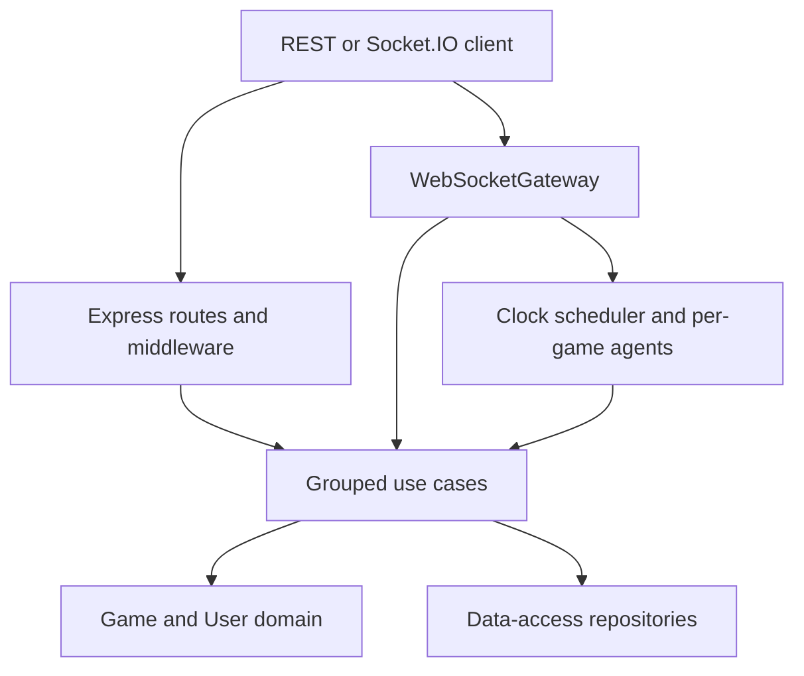
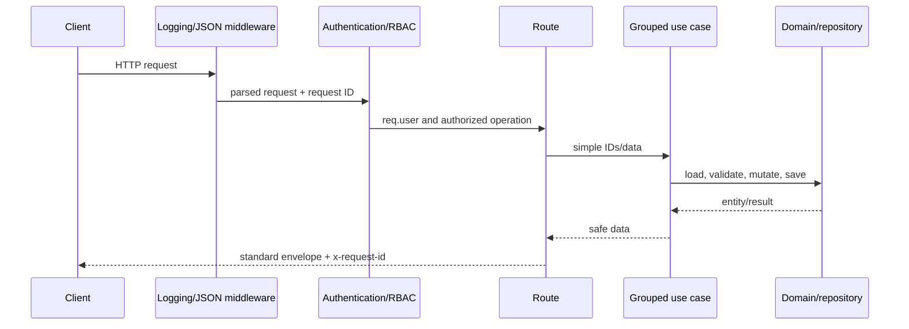
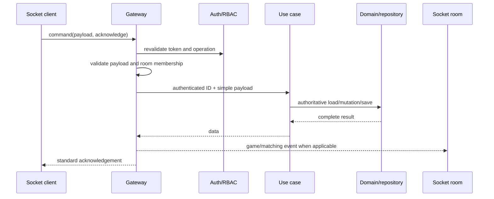
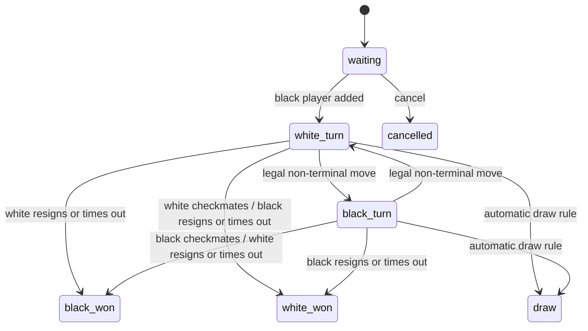

# Architecture and runtime data flow

Backend v2 uses a small layered architecture. The goal is to keep transport details outside business
logic while avoiding one class per individual use case.

## Component responsibilities

### Entrypoints and composition

- `src/config.js` contains only editable application and MySQL fields.
- `src/createApplication.js` is the single composition root. It creates the database, repositories,
  use cases, Express, Socket.IO, routes, scheduler, and gateway. After database initialization it
  restores active clocks and automated games.
- `src/server.js` only starts the composed application and handles `SIGINT`/`SIGTERM`.

### Transport layer

- `src/api/routes` validates HTTP-specific required fields, calls a grouped use case, chooses status,
  and formats the standard envelope.
- `src/api/middleware` owns request logging, bearer authentication, operation/resource authorization,
  not-found handling, and centralized errors.
- `src/websocket/WebSocketGateway.js` owns socket authentication, command validation, private/game
  rooms, acknowledgements, broadcasts, and mapping commands to grouped use cases.

Transport code does not decide chess legality, update Elo, generate domain IDs, or access repository
internals.

### Grouped use cases

- `AuthUseCases`: create/revoke sessions and resolve authenticated users.
- `UsersUseCases`: create/read/update/delete users and change roles after transport authorization.
- `GamesUseCases`: load games, apply moves/resignation/timeout, persist results, and update statistics.
- `MatchmakingUseCases`: human duration queues, cancellation, and immediate agent-game creation.
- `AutomatedPlayersUseCases`: list agents, create/recover a per-game strategy, choose a move, and send
  it through `GamesUseCases`.

Use cases accept simple IDs/data objects and return simple data objects. They contain no Express or
Socket.IO objects.

### Domain

- `User` validates identity, roles, account type, profile changes, statistics, and Elo calculation.
- `Game` owns the entire chess state machine: players, turns, move validation/history, FEN, clocks,
  checkmate, automatic draws, resignation, timeout, and cancellation.
- `chess.js` supplies board rules behind `Game`; routes/use cases do not operate a separate board.

### Data access

The executable server creates one `SequelizeDataAccess` adapter with MySQL. A small JavaScript
contract check defines the required users, games, sessions, matchmaking, agents, IDs, and
transaction methods.
Repositories reconstruct domain objects and keep Sequelize models invisible to use cases.

Users and agents are reconstructed with joined parent/subtype queries. Games are composed from
joined participant-junction and ordered move rows. Transaction-scoped
repositories atomically save terminal games/statistics and matchmaking claims. Optimistic versions
reject stale writes with `GAME_CONFLICT`. See [DATABASE_SCHEMA.md](./DATABASE_SCHEMA.md).

### Runtime components

- `GameTimeoutScheduler` owns process-local timers keyed by `gameId:activePlayerId`.
- `AutomatedPlayersUseCases.gameAgents` holds one short-lived strategy instance per automated game.
- `MonteCarloChessAgent.js` contains the rollout search, worker entry point, and its bounded FIFO queue.
- `StrongSearchAgent.js` contains the classical search, opening book, worker entry point, and its
  bounded FIFO queue.
- `UciEngineAgent` and `RemoteEngineAgent` isolate external engine protocols behind the same
  `chooseMove` interface and validate every returned move before falling back locally.
- Socket.IO holds connection and room membership in memory.

Runtime state is derived from authoritative Game/agent records when possible; it is not part of the
Game schema.

## HTTP data flow

Middleware order:

1. CORS.
2. Request logger assigns `x-request-id` and logs on response completion.
3. Express JSON parsing.
4. Public health/auth endpoints.
5. Bearer authentication at protected router boundaries.
6. Operation/resource authorization inside routes.
7. Final `ROUTE_NOT_FOUND` middleware.
8. Error handler preserving `AppError` and masking unexpected errors.

Authentication establishes identity. RBAC says whether that identity may attempt an operation.
Domain checks still enforce participation, active state, turn, and chess legality.

## Socket command data flow

Game broadcasts may arrive before the initiating command acknowledgement. In an agent game, the
gateway intentionally broadcasts the human result, waits for the agent result, broadcasts it, then
acknowledges with the final state.

REST responses, socket acknowledgements, handshake failures, and broadcasts all use the same
`{ success, data, error }` envelope.

## Game state machine

Public matchmaking stores a ticket while waiting, not a waiting Game. The Game is constructed and
immediately activated when the second human or an agent is assigned. `cancelled` remains a domain
state for a waiting Game but is not the result of `matching:cancel`, which deletes a ticket.

## Clock model

Each timed Game stores:

- original `durationMinutes`;
- white and black remaining milliseconds finalized at their last completed turn;
- `turnStartedAt` for the currently active player.

When a move begins, `Game` recalculates the mover's effective remaining time from the current time.
If exhausted, it resolves timeout instead of applying the move. Otherwise it applies the move,
persists the reduced remaining time, and resets `turnStartedAt` for the next player.

The scheduler cancels any prior game timer and schedules only the active participant. Its callback
includes the expected player ID, so a stale callback after a turn transition does not expire the new
player. Confirmed timeout follows normal persistence/statistics and `game:finished` flow.

Timers are local to one Node process. Shared deployment needs a recoverable scheduler.

## Agent architecture

The persisted relationship is Game player ID -> automated User -> agent configuration. Runtime search
objects are created only when `agent:join` creates a game or recovery discovers an automated game.

For every agent turn:

1. the gateway passes the post-human Game to `playTurn`;
2. the strategy reads the authoritative FEN;
3. it returns `{ from, to, promotion }` only;
4. `GamesUseCases.makeMove` reloads and applies that move through `Game`;
5. normal persistence, clocks, results, statistics, and events apply.

The runtime object is removed on terminal result or administrative game deletion. Search tree memory
is not persisted because the current position and configuration are sufficient to restart.

## Startup and shutdown

Startup must complete before listening:

1. the MySQL adapter creates the configured database if missing, applies pending schema migrations,
   and adds missing initial data;
2. timeout restoration reads all active timed games and schedules the current players;
3. gateway restoration reads games, rebuilds automated strategies, and schedules pending automated
   turns with `setImmediate` so thinking does not delay the listener;
4. `server.js` starts the HTTP listener.

Shutdown clears timers, disconnects tracked sockets, closes Socket.IO, and closes the MySQL pool.
Applied migrations are recorded in `SequelizeMeta` and are not rerun.

## Security and persistence constraints

- Passwords are plain text only because that is an explicit current requirement; responses hide them.
- Sessions are stored in MySQL; expiration is nullable and no issuance policy is configured yet.
- CORS defaults to the documented local frontend origins and can be overridden with `CORS_ORIGIN`.
- Matchmaking, timers, socket rooms, and runtime agents are process-local.
- MySQL transactions cover matchmaking game creation and game/result/statistics writes.
- Submission limitations are listed in the root [README](../../README.md#known-limitations).
