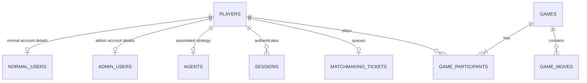

# Implemented MySQL database schema

Backend v2 uses Sequelize 6 with MySQL. Application code opens the database with one public class:

```js
const config = require("./src/config");
const Database = require("./migrations/sequelize/Database");
const database = new Database(config);
await database.initialize();
```

Routes and use cases only use repositories. They never import Sequelize or query tables directly.

## Setup

Connection settings are loaded from `backend/.env` through `src/config.js`:

```text
DB_DIALECT
DB_HOST
DB_PORT
DB_NAME
DB_USER
DB_PASSWORD
```

`Database.initialize()` connects to MySQL, creates `database_name` when missing, and synchronizes
the development schema from `models.js`, including additive profile fields such as email/theme. It
inserts initial records when `players` is empty and fills missing built-in account defaults without
deleting user data. Drop the database through MySQL when a full development reset is required.
End-to-end tests use `${database_name}_end_to_end`, build
it from nothing, exercise the public APIs, and remove it afterward.

## Logical model

`players` is the shared parent of every participant that can own statistics or play a game.
`normal_users`, `admin_users`, and `agents` are one-to-one extensions containing only subtype data.



The `players.type` discriminator is `normal_user`, `admin`, or `agent`. It tells the repository which
one-to-one extension is valid. Common names, statistics, and Elo exist in only one place.

## Tables

### `players`

| Column | MySQL type | Rules |
|---|---|---|
| `id` | `VARCHAR(64)` | Primary key |
| `type` | `ENUM` | `normal_user`, `admin`, or `agent` |
| `first_name`, `last_name` | `VARCHAR(100)` | Required display profile |
| `email` | `VARCHAR(255)` | Unique and nullable for agents; human login/settings identity |
| `theme` | `ENUM` | `dark` or `light`; default `dark` |
| `wins`, `losses`, `draws` | unsigned integer | Default 0 |
| `elo` | unsigned integer | Default 1200 |
| timestamps | `DATETIME(3)` | Required |

This is the common foreign-key target for sessions, matchmaking, and game history.

### `normal_users`

| Column | MySQL type | Rules |
|---|---|---|
| `player_id` | `VARCHAR(64)` | Primary key and FK to `players`; cascade delete |
| `password` | `VARCHAR(255)` | Required; currently plain text by project requirement |
| `role` | `ENUM` | `user` or `manager` |

### `admin_users`

| Column | MySQL type | Rules |
|---|---|---|
| `player_id` | `VARCHAR(64)` | Primary key and FK to `players`; cascade delete |
| `password` | `VARCHAR(255)` | Required |

The admin role is implied by `players.type`. Accounts cannot transition between admin and normal
subtypes.

### `agents`

| Column | MySQL type | Rules |
|---|---|---|
| `id` | `VARCHAR(64)` | Public agent selector and primary key |
| `player_id` | `VARCHAR(64)` | Unique FK to `players`; cascade delete |
| `strategy` | `VARCHAR(64)` | Supported application strategy key |
| `difficulty` | `VARCHAR(32)` | Client-facing difficulty |
| `config` | `JSON` | Server-owned strategy settings |
| `enabled` | boolean | Availability |
| timestamps | `DATETIME(3)` | Required |

Agent names, statistics, and Elo come from the parent `players` row. Agents have no password and
cannot create sessions.

### `games`

| Column | MySQL type | Rules |
|---|---|---|
| `id` | `VARCHAR(64)` | Primary key |
| `state` | `ENUM` | Ongoing or terminal Game state |
| `end_reason` | `ENUM`, nullable | Set after termination |
| `duration_minutes` | unsigned integer, nullable | Time-control configuration |
| `white_remaining_ms`, `black_remaining_ms` | unsigned bigint, nullable | Stored clocks |
| `turn_started_at` | `DATETIME(3)`, nullable | Start of active turn |
| `version` | unsigned integer | Optimistic update version |
| timestamps | `DATETIME(3)` | Required |

Current player, winner, ply count, and FEN are derived by the Game domain rather than duplicated.

### `game_moves`

| Column | MySQL type | Rules |
|---|---|---|
| `id` | unsigned bigint | Auto-increment primary key |
| `game_id` | `VARCHAR(64)` | FK to `games`; cascade delete |
| `ply` | unsigned integer | Unique with game ID |
| `uci` | `VARCHAR(5)` | Compact authoritative move |
| `san` | `VARCHAR(32)` | Display notation |
| `created_at` | `DATETIME(3)` | Required |

Moves have a many-to-one relationship with games and are always reconstructed in ply order.

### `game_participants`

The junction table between games and players.

| Column | MySQL type | Rules |
|---|---|---|
| `game_id` | `VARCHAR(64)` | FK to `games`; cascade delete |
| `color` | `ENUM(white, black)` | Composite primary key with game ID |
| `player_id` | `VARCHAR(64)` | FK to `players`; restricted delete |

`(game_id, player_id)` is unique, preventing self-play. A player with game history cannot be
deleted; the repository returns `409 USER_HAS_GAMES`.

### `sessions`

| Column | MySQL type | Rules |
|---|---|---|
| `token` | `VARCHAR(255)` | Primary key |
| `player_id` | `VARCHAR(64)` | Indexed FK to `players`; cascade delete |
| `created_at` | `DATETIME(3)` | Required |
| `expires_at` | `DATETIME(3)`, nullable | Reserved expiration support |

Application validation rejects sessions for players of type `agent`.

### `matchmaking_tickets`

| Column | MySQL type | Rules |
|---|---|---|
| `id` | `VARCHAR(64)` | Primary key |
| `player_id` | `VARCHAR(64)` | Unique FK; one ticket per player |
| `duration_minutes` | unsigned integer | Queue key |
| `created_at` | `DATETIME(3)` | FIFO order |

The `(duration_minutes, created_at)` index supports selecting the oldest compatible ticket.

## Where schema logic lives

- `Database.js` is the one runtime entry point. It owns the connection, repositories, transactions,
  automatic database/table creation, initial data, and shutdown.
- `models.js` is the single schema definition. It contains columns, types, associations, foreign-key
  deletion behavior, uniqueness rules, and indexes used by both synchronization and queries.
- Repositories contain data-access queries only. There are no migration or schema-manager files.

This project intentionally favors one current schema over historical migrations. Normal startup uses
non-destructive `sync()`. Model changes that require modifying existing tables are applied by
dropping the development database and restarting; preserving production data would require a future
migration strategy.

## Repository joins

Joins are used where they remove extra queries and return one logical aggregate:

- Users load `players` with the matching normal/admin/agent extension in one query.
- Agents load their parent `players` row in one query for name, Elo, and statistics.
- Games load participants and ordered moves together. `findByPlayerId` also filters through a joined
  participant alias, avoiding one query per game.

Sessions and matchmaking deliberately do not join `players`: those methods only read or write a
token/ticket and player ID. Loading a full player would add unused data and couple simple persistence
operations to profile data.

## Repository contract and transactions

The data-access contract remains:

```text
users.findById/findAll/create/update/delete
games.findById/findAll/findByPlayerId/create/update/delete
sessions.create/findUserId/delete
matchmaking.findByUserId/takeWaiting/create/delete
agents.findById/findByUserId/findAll
ids.next
transaction(work)
```

Repository return values are deliberately consistent:

- User reads return `User` domain objects or `null`; `findAll` returns `User[]`.
- Game reads return `Game` domain objects or `null`; list operations return `Game[]`.
- Agent reads return plain `{ id, userId, name, elo, strategy, difficulty, enabled, config }` objects.
- Matchmaking reads return plain `{ id, userId, durationMinutes, createdAt }` ticket objects.
- Session lookup returns a user ID or `null`; create/delete operations return booleans.

`Database.transaction` gives the callback a small repository collection whose repositories all share
one Sequelize transaction. Matchmaking claims a ticket and creates the human game atomically. Move, resignation,
and timeout flows atomically persist the Game, appended moves, and player statistics/Elo. Optimistic
game versions reject stale updates with `GAME_CONFLICT`.

## Initial data

The first initialization of an empty database creates:

- admin player `1`, `admin@chessgrove.local / admin123`;
- manager player `2`, `manager@chessgrove.local / manager123`;
- normal player `3`, `player@chessgrove.local / player123`;
- random, heuristic, Monte Carlo, strong-search, UCI, and remote agent players and configurations.

Later startups preserve user data and add any missing built-in agent rows.
