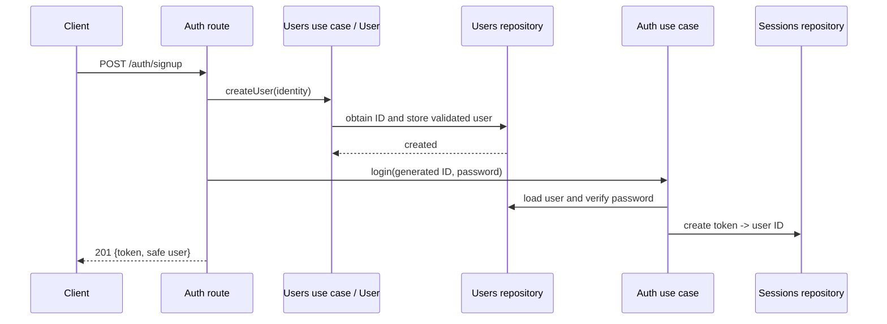
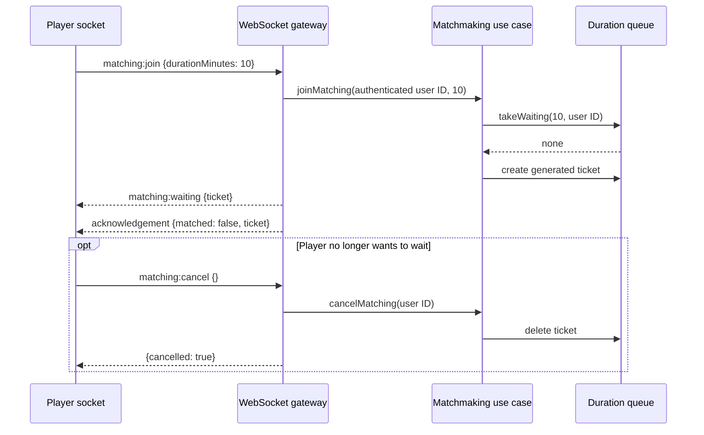
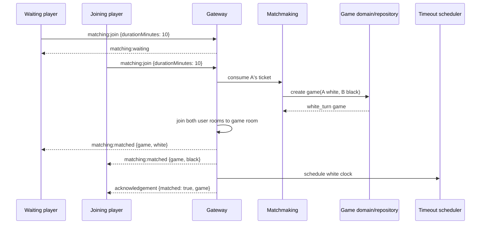
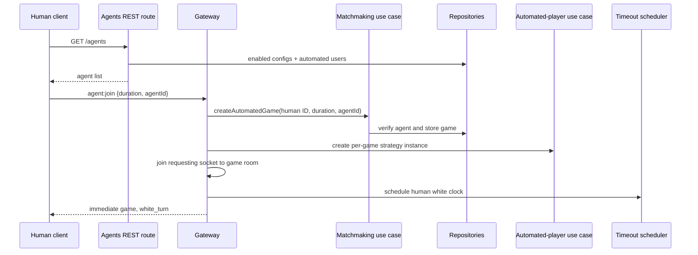
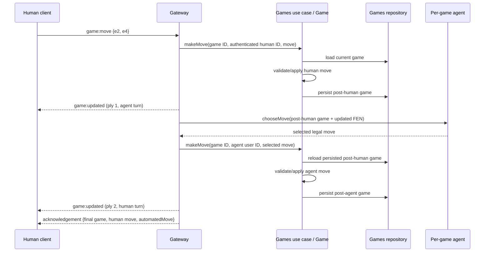

# Complete user flows

This document describes what a client does and how data moves through the backend for each supported
journey. Exact payloads are in [REST_API.md](REST_API.md) and
[WEBSOCKET_API.md](WEBSOCKET_API.md).

## 1. Signup and initial session

Client sequence:

1. Send `POST /api/auth/signup` with first name, last name, and password.
2. Store the returned `data.user.id`; it is the ID used by future login requests.
3. Store `data.token` securely in client session state.
4. Use the token for protected REST requests and the Socket.IO connection.

Backend data flow:

The role is always `user`, `isAutomated` is false, statistics start at zero, and Elo starts at 1200.
Client attempts to submit role, automated status, or statistics are ignored.

## 2. Login and authenticated requests

Client sequence:

1. Send `POST /api/auth/login` with user ID and password.
2. Store the returned token.
3. Send `Authorization: Bearer <token>` with protected REST operations.
4. Create Socket.IO with `auth: { token }`.

Backend data flow:

1. Login loads the User, verifies the plain password, rejects automated users, generates a token,
   and stores the token-to-user mapping.
2. REST authentication later extracts the bearer token, resolves the latest user, and assigns
   `req.user`/`req.authToken`.
3. Route authorization checks the operation and, where required, target ownership.
4. Socket authentication does the same during the handshake and repeats it before every command.

Login is an entry point that creates a session. Authentication middleware consumes an existing
session; it never checks a password or creates a token.

## 3. Profile management

Read/update own profile:

1. Call `GET /api/users/me` to load authoritative user data.
2. Call `PUT /api/users/me` with one or more of `firstName`, `lastName`, and `password`.
3. The route derives the target ID from the token.
4. The User entity validates the partial update and the repository saves it.
5. The client replaces its cached User with the returned safe object.

Managers/admins can read or edit another profile through `/api/users/:userId`. Profile endpoints
cannot change roles, Elo, statistics, or automated status. An admin changes a role through the
dedicated `/api/users/:userId/role` endpoint, limited to `user` and `manager` normal accounts.

## 4. Logout

Client sequence:

1. Send `POST /api/auth/logout` with the active bearer token.
2. Clear that token from client storage.
3. Treat any associated socket disconnect as expected.

Backend data flow:

1. Authentication validates the session one last time.
2. The session repository deletes that exact token.
3. The gateway disconnects sockets authenticated by that token.
4. Matchmaking removes a waiting ticket for that user if present.
5. The response confirms logout.

Logout does not resign or cancel an active game. A user can log in later, read `/games/my`, reconnect,
and call `game:join`. Other independently created tokens for the user remain valid.

## 5. Human matchmaking: wait, cancel, or match

All players first authenticate their Socket.IO connection.

### Waiting and cancellation

A user has at most one waiting ticket. Repeating `matching:join` returns that ticket. Queues are
separate by exact duration. Logout and user deletion also remove a waiting ticket.

### Two humans match

The earlier waiting player is white; the player who completes the pair is black. Every socket
currently connected for either user is put in the game room, so both can immediately use live game
commands. The Game begins at `white_turn` with equal clocks.

## 6. Two-human game play

Client sequence for a turn:

1. Optionally ask `game:legal-moves { gameId }` when it is this user's turn.
2. Emit `game:move { gameId, from, to, promotion? }`.
3. Listen for `game:updated` and replace the local Game with `event.data.game`.
4. Treat the acknowledgement as confirmation or error; the event may arrive before it.
5. The other player receives the same event and becomes current player.

Backend data flow:

1. Gateway verifies current session, move permission, and room membership.
2. Game use case loads the latest Game.
3. Game domain validates participant, turn, clock, and move legality.
4. Domain deducts elapsed clock time, stores UCI/SAN history, derives FEN, and advances state.
5. Repository saves the Game.
6. If still active, scheduler replaces the old timer with the next player's timer.
7. Gateway broadcasts complete state in `game:updated`.

The server never trusts a player ID from the command. Identity always comes from the session.

## 7. Discover and start an automated game

Client sequence:

1. Call `GET /api/agents` with the bearer token.
2. Show returned agent name, difficulty, Elo, and optional think time.
3. Emit `agent:join { durationMinutes, agentId }`.
4. Store the returned Game ID and render the human as white.
5. Listen for the same enveloped `game:updated` and `game:finished` events used by human games.

Backend data flow:

This path complements human matchmaking; it does not replace it. It creates no queue ticket and does
not wait for another socket. A user already waiting for a human must cancel that ticket first. Only
the requesting socket joins the agent-game room.

## 8. Human move followed by agent move

This is the complete authoritative update sequence.

The agent does not maintain a separate chess state that can become stale. It receives the newly
updated Game and creates its board from `game.fen`. Its move is then applied through the same domain
and persistence path as a human move. The client receives two live updates: first its accepted move,
then the agent reply. The acknowledgement returns only after the agent completes its configured
thinking time.

If the human move checkmates or draws, the agent is not called. If the agent reply ends the game, its
second event is `game:finished`.

## 9. Reconnect, reload, and missed events

Socket room membership is not persistent. After a connection loss:

1. Reconnect Socket.IO with a still-valid token.
2. Obtain known game IDs from client state or `GET /api/games/my`.
3. Emit `game:join { gameId }` for the active game.
4. Replace local state with the acknowledgement Game.
5. Resume listening for game events.
6. Emit `game:sync { gameId }` later whenever an event gap or acknowledgement timeout is suspected.

`game:join` loads and authorizes the Game, joins the room, reconstructs a missing runtime agent, and
finishes an interrupted pending agent turn if necessary. `game:sync` is read-only and requires room
membership.

## 10. Resignation

Client sequence:

1. A participant emits `game:resign { gameId }`.
2. Both room members receive `game:finished { game, move: null }`.
3. The resigning client also receives the finished Game in its acknowledgement.
4. Clients refresh profile data if they want the new statistics/Elo immediately.

Backend data flow:

1. Game domain verifies active state and participant identity.
2. Opponent becomes winner; reason becomes `resignation`; clock stops.
3. Game is saved.
4. Winner/loser counts and both Elo values are updated.
5. Timer and runtime agent are removed.
6. Finished state is broadcast.

## 11. Checkmate and automatic draws

After every applied move, the Game domain checks checkmate, stalemate, threefold repetition,
insufficient material, fifty-move rule, and other `chess.js` draw conditions.

If terminal:

1. The domain sets terminal `state`, `endReason`, `winnerId`, clears `currentPlayerId`, and stops the
   clock.
2. Game use case persists the result.
3. Both players receive statistics and K-factor-32 Elo updates; a draw increments both draw counts.
4. Gateway removes the timer/runtime agent.
5. `game:finished { game, move }` carries the finishing move.

Draw offers are intentionally absent. Only automatic chess draw rules are supported.

## 12. Timeout

The client displays a clock from Game data but does not declare timeout.

Backend flow:

1. Scheduler tracks the active `gameId:playerId` timer.
2. At expiry it asks the game use case to check that exact player.
3. The Game recalculates elapsed time from `turnStartedAt`; a stale timer does nothing.
4. A confirmed timeout sets the opponent win and `endReason: timeout`, persists the Game, and updates
   both users' statistics/Elo.
5. Gateway cleanup removes any runtime agent and emits `game:finished { game, move: null }`.

## 13. Administrative user flow

Manager:

1. Login normally.
2. List users and games.
3. Create `user`/`manager` accounts without creating sessions for them.
4. Read/update any profile.

Admin additionally:

1. Create admin accounts.
2. Change normal accounts between `user` and `manager`; admin-table transitions are forbidden.
3. Delete users only when they have no game history; sessions/tickets cascade and sockets disconnect.
4. Delete games; timer and runtime agent are removed, but statistics are not changed and no game event
   is emitted.

Administrative read permission never grants the right to make a move or resign on behalf of a player.

## 14. Application restart and agent recovery

At startup, application lifecycle reads all games twice through the grouped use cases:

1. Timeout restoration schedules each active timed game's current player.
2. Agent restoration identifies active games containing configured automated users.
3. A per-game strategy instance is rebuilt from agent configuration.
4. If the stored state says it is the agent's turn, a fresh search is scheduled from the stored FEN.

Search memory is deliberately not persisted; it is move-local and can be recomputed from the
MySQL-backed authoritative game state. Only interrupted search work is lost.
