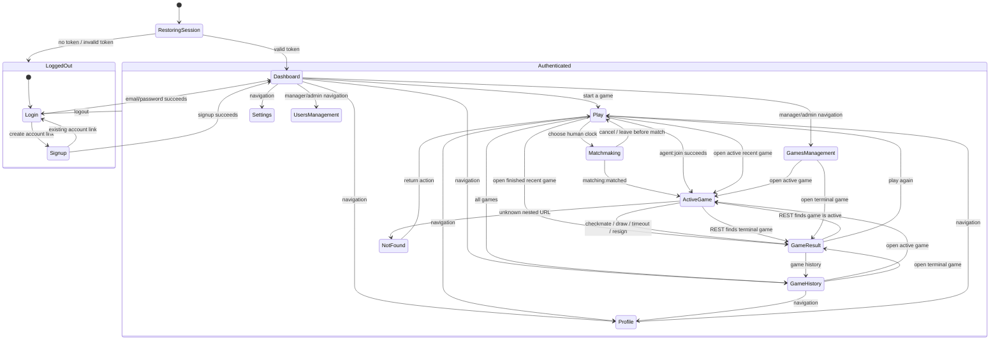
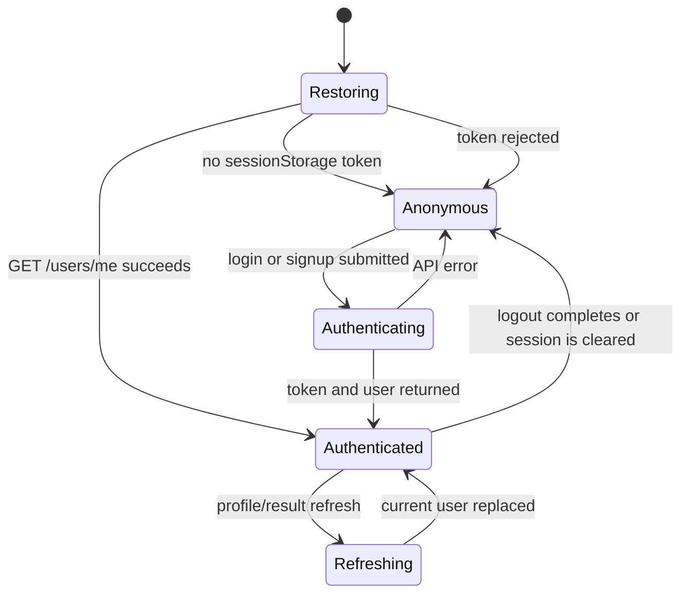
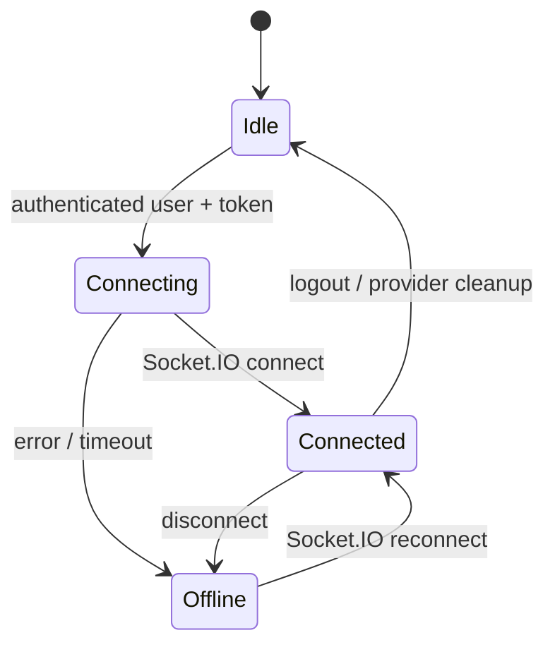
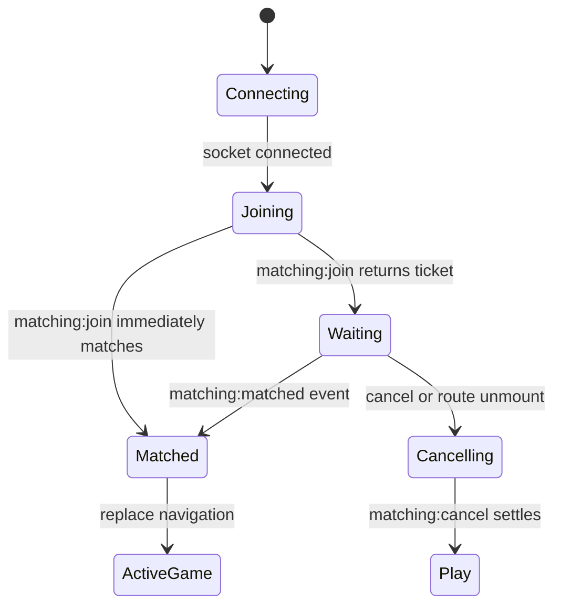
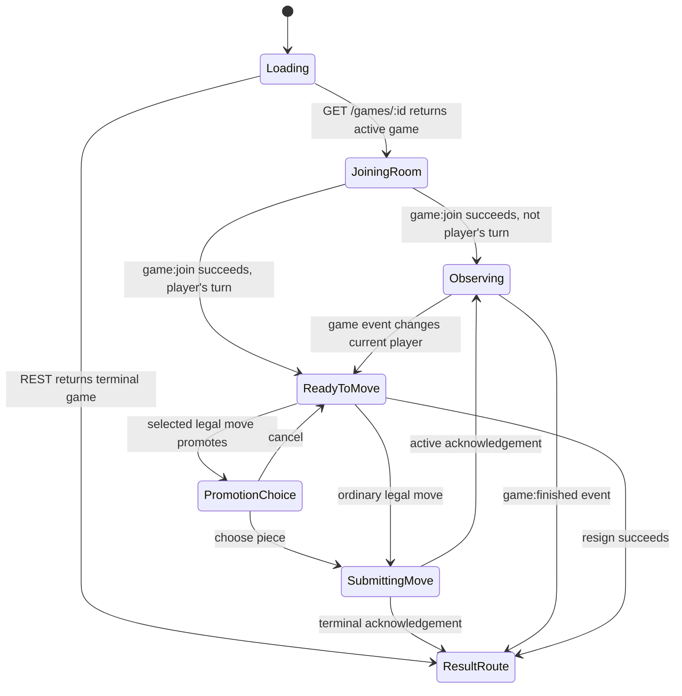

# Frontend architecture and state machines

## Architecture summary

The frontend is a routed React application. A visible workflow state has a URL, pages own their
REST data and actions, reusable components receive values and callbacks, and only authentication
plus the Socket.IO connection live above the route tree.

```text
index.js
  App
    AuthProvider                session token + current user
      LiveProvider             authenticated Socket.IO connection
        BrowserRouter
          route guards
            AppLayout          authenticated navigation shell
              page             route-specific state and data
                components     rendering and user callbacks only
```

REST reconstructs any page after a refresh. Socket.IO provides matchmaking, room membership, game
commands, and live updates after the page exists. `server.js` returns `build/index.html` for unknown
GET paths without file extensions, allowing direct requests to routes such as
`/games/:gameId/play` to reach React Router.

## Complete page state machine



Route guards apply before page rendering:

- `PublicOnly` sends an already authenticated tab from `/login` or `/signup` to `/dashboard`.
- `Authenticated` sends a tab without a valid user to `/login`.
- `ManagersOnly` sends ordinary users away from management routes to `/dashboard`.
- Backend authentication and RBAC remain authoritative; guards only improve navigation.

## Global state machines

### Authentication



The token uses `sessionStorage`, so refreshes preserve one tab while separate tabs can log into
different accounts. `AuthProvider` owns the current User; pages must not maintain competing global
user copies.

### Live connection



`LiveProvider` retains only cross-route live signals: connection status, the current waiting
ticket, a newly matched game, and the latest event for each game ID. Authoritative game details are
still reloaded by the page route.

## Page-local state machines

### Matchmaking



The page owns cancellation. Unmounting before a match sends `matching:cancel`; a completed match
sets a ref first so route cleanup does not cancel an already-created game.

### Active game



The board is always rendered from authoritative FEN. Legal destinations enable interaction but do
not mutate a local board. After a command, `GamePage` replaces its complete Game value from the
acknowledgement or socket event.

Captured material is derived from ordered UCI history by replaying the moves in
`CapturedMaterial.jsx`. It handles normal captures, en passant, castling rook movement, and
promotion. Piece values are pawn 1, knight 3, bishop 3, rook 5, and queen 9. Both bars show the
opponent pieces that player captured; only the material leader displays `+N`.

## Page responsibilities

| Page | Purpose and owned state | Integration |
|---|---|---|
| `LoginPage` | Validated email/password form, submission, loading, and error state | Calls `AuthProvider.login`; replaces route with `/dashboard` |
| `SignupPage` | Public name/email/password account creation | Calls `AuthProvider.signup`; replaces route with `/dashboard` |
| `DashboardPage` | REST-backed statistics cards and game table with loading/error/empty states | Loads `/users/me` and `/games/my`; links into existing chess flows |
| `SettingsPage` | Loads and validates name, email, and theme preferences | Uses `GET/PUT /settings` and replaces the shared User after save |
| `PlayPage` | Main start screen, clock selections, agent selection, recent games | REST loads agents/games; Socket.IO creates agent games; routes human play to matchmaking |
| `MatchmakingPage` | Owns joining, waiting, cancellation, and matched navigation | Uses `LiveProvider.command` and cross-route `matchedGame` signal |
| `GamesPage` | Current user's active and historical games | Loads `/games/my`; delegates route choice to `GameCard` |
| `GamePage` | Active board, room join, legal moves, move/resign commands, promotion, events | Combines REST reconstruction with Socket.IO commands/events; terminal states replace to result |
| `GameResultPage` | Terminal outcome and navigation | Reloads game, redirects active games back to play, refreshes user statistics |
| `ProfilePage` | Current user's profile and password edits | REST update replaces shared `AuthProvider.user` |
| `UsersPage` | Manager/admin list, create/edit; admin role/delete controls | Calls user REST endpoints; backend enforces role transitions and deletion rules |
| `ManageGamesPage` | Manager/admin view of all games; admin deletion | Loads `/games`; uses shared game routing helpers |
| `NotFoundPage` | Authenticated fallback for unknown routes | Returns to `/play` |

## Component responsibilities

| Component/helper | Purpose | Inputs and integration |
|---|---|---|
| `AppLayout` | Shared authenticated shell | Composes `Navbar`, current route `Outlet`, and `Footer` |
| `Navbar` | Logo, routes, user name, live status, and logout | Refreshes `/users/me` on mount and uses both providers |
| `Footer` | Team, current year, and project slogan | Rendered on every authenticated page |
| `Card` | Generic title/value/description container | Used four times for dashboard statistics |
| `DataTable` | Generic columns/rows renderer with empty state | Maps the dashboard's backend game array |
| `ChessBoard` | Parses FEN, renders 64 fixed squares, selection, legal targets, last move | Receives legal moves and callbacks; never calls network services |
| `ChessPiece` | SVG rendering for all six piece types | Used by board, promotion dialog, and captured-material display |
| `CapturedMaterial` | Replays UCI moves and renders captured pieces plus material advantage | `GamePage` passes each player's calculated material summary |
| `PlayerClock` | Derives a live display from stored remaining time and turn timestamp | Recalculates every 250 ms; never changes authoritative clock data |
| `GameCard` | Compact game summary and correct active/result link | Exports `gameLabel`, `gameRoute`, and `isFinished` shared by pages |
| `PageState` | Consistent loading, error, and empty states | Receives messages/errors; has no application state |
| `PromotionDialog` | Pauses a promoting move until queen/rook/bishop/knight is selected | Local helper inside `GamePage` because it belongs only to that workflow |
| `PlayerBar` | Player identity, turn marker, captures, advantage, and clock | Local helper inside `GamePage` |
| `MoveList` | Groups SAN history into numbered white/black rows | Local helper inside `GamePage` |

## Contexts, classes, and infrastructure

| File/class | Purpose and boundary |
|---|---|
| `AuthContext / AuthProvider` | Owns token restoration, current User, login, signup, logout, and refresh |
| `LiveContext / LiveProvider` | Owns one socket per authenticated tab and translates server events into small cross-route signals |
| `ApiClient` | Adds bearer authentication, unwraps the universal response envelope, normalizes REST/network errors, and exposes named endpoint methods |
| `LiveClient` | Wraps Socket.IO connection, event listeners, acknowledgement timeouts, universal envelopes, and disconnection |
| `App` | Composes providers, router, guards, and the complete route table |
| `index.js` | Mounts the React application once |
| `config.js` | Supplies backend REST/socket locations and socket timeout |
| `server.js` | Serves the production build and provides history fallback for browser routes |

## Principal data flows

### Human game

1. `PlayPage` navigates to `/matchmaking?minutes=N`.
2. `MatchmakingPage` sends `matching:join`.
3. A returned match or `matching:matched` event supplies a Game.
4. The route is replaced with `/games/:id/play`, passing the Game only as a fast initial value.
5. `GamePage` reloads the Game through REST and joins its socket room.

### Agent game

1. `PlayPage` loads only currently available agent records.
2. `agent:join` creates the persisted game and its per-game agent.
3. The response follows the same `/games/:id/play` route as a human game.
4. Human moves and automated replies arrive in the same Game/update format.

### Move and result

1. `GamePage` requests legal moves only when the authenticated user is current.
2. `ChessBoard` reports a chosen source/destination; promotion requests a piece first.
3. `game:move` returns the authoritative human move, optional automated move, and Game.
4. Active games replace local page data; terminal games replace the route with the result page.
5. `GameResultPage` reloads the terminal Game and refreshes user Elo/statistics.

### Profile and management

Profile edits update the shared User immediately. Management pages reload their own lists after
mutations instead of trying to patch multiple cached views. Backend responses remain authoritative
for access control, immutable admin boundaries, game-history deletion restrictions, and role rules.
